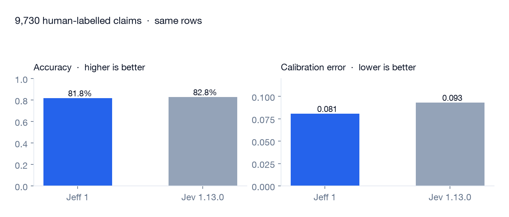
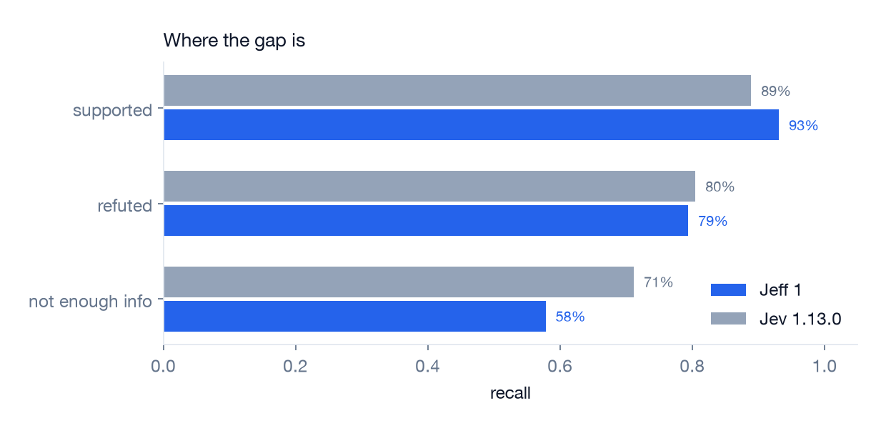
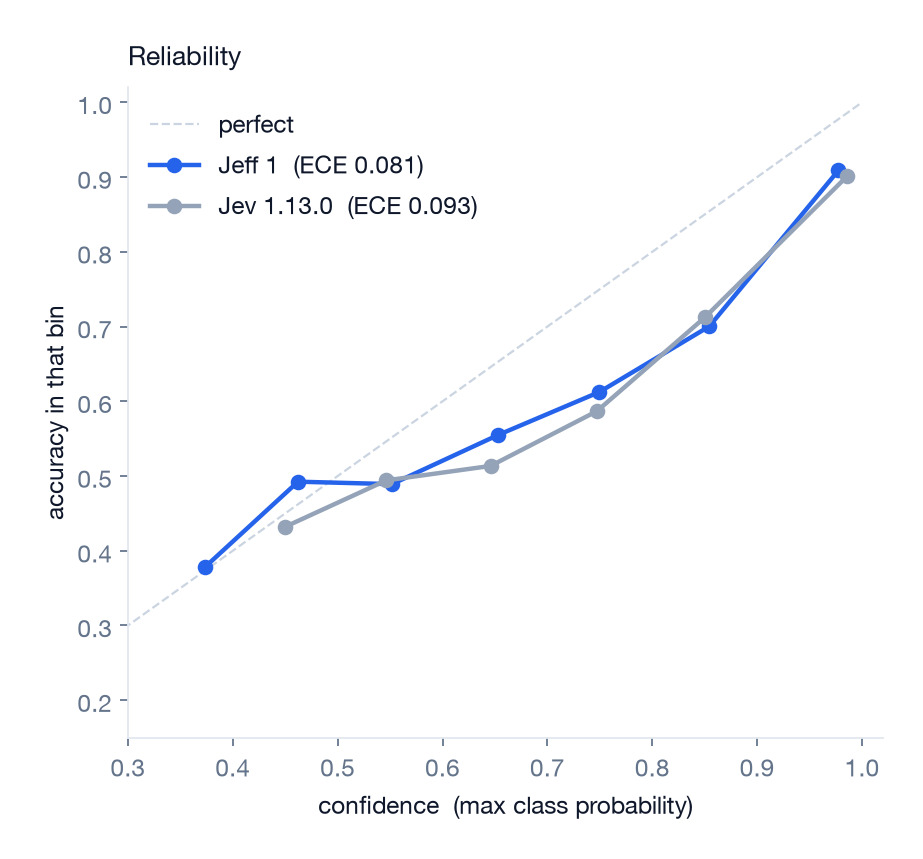

# Jeff 1

An open-source, locally runnable typed decision model.

Jeff takes a **state** (a claim and its evidence, or any other structured
input) plus **typed questions**, and returns probability distributions
over the labels you declared. It speaks the same Choice / Noul / Score
shape as TypeSafe Jev, but the weights run on your machine.

- Code: [github.com/Gestalt-Lab/jeff](https://github.com/Gestalt-Lab/jeff)
- Weights: [huggingface.co/GestaltLabs/Jeff-1](https://huggingface.co/GestaltLabs/Jeff-1)
- License: Apache 2.0
- Agent entrypoint: [`AGENTS.md`](AGENTS.md)

Jeff is independent. It is not affiliated with TypeSafe AI.

## What

Jeff 1 is **Qwen3-4B-Instruct-2507 + a rank-16 LoRA**. There is no
bolted-on classification head. The label set and each label's wording
arrive in the prompt at call time. The answer is read from the model's
own next-token distribution, restricted to those labels.

Three primitives:

| type | returns |
|---|---|
| `choice` | one label from a caller-supplied set, plus a distribution |
| `noul` | P(yes) for a presence / yes-no question |
| `score` | a distribution over ordered levels, plus an expected score |

It is a classifier, not a chat model. It does not generate JSON, does
not browse the web, and does not check claims against anything except
the evidence you passed in.

## Why

Hosted decision APIs are fast and closed. If you want to inspect the
weights, run offline, or point an agent at a repo instead of a vendor,
you need a local model with a typed contract.

Jeff exists so that “is this claim supported by *this* evidence?” is a
function call, not a paragraph of model prose you then have to parse.

## Why it matters

- **Open weights.** The adapter is Apache 2.0; the base model is Apache
  2.0. You can fine-tune, audit, or serve it without an API key.
- **Typed output.** Downstream code gets distributions that sum to 1,
  not free text.
- **Call-time schemas.** New label wording does not require a retrain.
- **Honest comparison.** We measured Jeff and live Jev 1.13.0 on the
  **same 9,730 human-labelled rows**. Jeff is slightly less accurate and
  better calibrated under one shared confidence definition. That gap is
  documented, not spun.

## Results

Measured on **9,730 human-labelled claims**, the same rows for both models.
Confidence is the maximum class probability. Argmax follows label insertion order.



| model | n | accuracy | macro-F1 | Brier | ECE |
|---|---:|---:|---:|---:|---:|
| **Jeff 1** | 9,730 | 0.8183 (7,962) | 0.7789 | 0.2839 | **0.0807** |
| live Jev 1.13.0 | 9,730 | **0.8283** (8,059) | 0.7994 | **0.2750** | 0.0932 |

Jev is about one accuracy point ahead (McNemar p = 0.0036; 95% CI on the
difference [+0.0033, +0.0165]). Jeff is better calibrated on this
definition; Jev is better on Brier. Jev also publishes a separate
internal confidence score (ECE 0.0790) that is not the same quantity.



Jeff is stronger on `supported` and weaker on `not_enough_info`. The
accuracy gap sits mostly on single-passage rows. On Climate-FEVER
(five passages) Jeff is ahead (0.669 vs 0.591).



These weights are `lora_4b_multi` — Choice, Noul, and Score. A 199-row
validation split exists (underpowered: a 3-row difference, p = 0.59) and
was scored with a different, Choice-only adapter.

## How to use

```bash
git clone https://github.com/Gestalt-Lab/jeff
cd jeff
uv sync
```

Python (downloads `GestaltLabs/Jeff-1` if the local adapter is absent):

```python
from jev_clf.client import SystemOneClient, Choice, Noul, Score

client = SystemOneClient()  # Qwen3-4B + Jeff-1 LoRA

result = client.system_one(
    {
        "claim": "The new training program made participants both faster and more accurate.",
        "evidence": [
            "New program mean time 42s vs standard 55s.",
            "Both groups scored 91% correct.",
        ],
    },
    {
        "verdict": Choice(
            instructions="Verdict from the evidence only.",
            criteria={
                "supported": "The passages guarantee the claim.",
                "refuted": "The passages guarantee the claim is false.",
                "not_enough_info": "The evidence is silent or mixed.",
            },
        ),
        "has_number": Noul(instructions="Does the evidence contain a number?"),
        "strength": Score(
            instructions="How strongly does the evidence settle the claim?",
            criteria=["none", "weak", "moderate", "strong"],
        ),
    },
)
print(result.choices["verdict"].choice, result.choices["verdict"].probabilities)
```

HTTP:

```bash
uv run python -m scripts.jev_clf_server   # http://127.0.0.1:8079
# POST /v1/systemone   GET /   GET /v1/models   GET /health
```

Direct PEFT load:

```python
from transformers import AutoModelForCausalLM, AutoTokenizer
from peft import PeftModel

base = "Qwen/Qwen3-4B-Instruct-2507"
tok = AutoTokenizer.from_pretrained(base)
model = AutoModelForCausalLM.from_pretrained(base, dtype="bfloat16")
model = PeftModel.from_pretrained(model, "GestaltLabs/Jeff-1")
```

## Known issues

1. **Over-claiming.** Jeff answers `supported` for 12.3% of gold-refuted
   rows (Jev 6.2%) and 24.4% of gold-NEI rows (Jev 14.3%). Conjunctions
   with one true half are a typical failure.
2. **`not_enough_info` on single-passage rows** accounts for most of the
   accuracy gap. Multi-passage Climate-FEVER is a Jeff win (0.669 vs 0.591).
3. **Serial questions.** One forward pass per question. Jev stays roughly
   flat as question count grows; Jeff does not.
4. **Score readout.** Levels `" 0"`…`" 3"` share a first token, so Score
   uses whole-sequence scoring (extra passes).
5. **Probes.** Jaggedness 8/9 vs Jev 9/9. Conjunction 5/9 vs 9/9. The
   HTTP schema supports the three primitives; that is not the same as
   matching Jev on every reasoning pattern.
6. **Other adapters.** `lora_merged` and unpublished distillation
   checkpoints are unevaluated.
7. **This scale split already informed error analysis**, so it is not a
   fresh holdout for later designs.

Full write-up: [`RELEASE_JEFF1.md`](RELEASE_JEFF1.md),
[`MODEL_CARD_JEFF1.md`](MODEL_CARD_JEFF1.md),
[`PROVENANCE.md`](PROVENANCE.md).

## Layout

| path | what |
|---|---|
| `jev_clf/` | schema, client, readout, eval |
| `scripts/jev_clf_server.py` | local HTTP API (port **8079**) |
| `scripts/audit_decision_results.py` | fail-closed paired metrics |
| `data/factcheck/` | gold labels and saved predictions |
| `artifacts/` | gitignored; get weights from Hugging Face |

A separate diffusion-head project (d-Jeff) is planned. This repository
is the released one-shot classifier.
